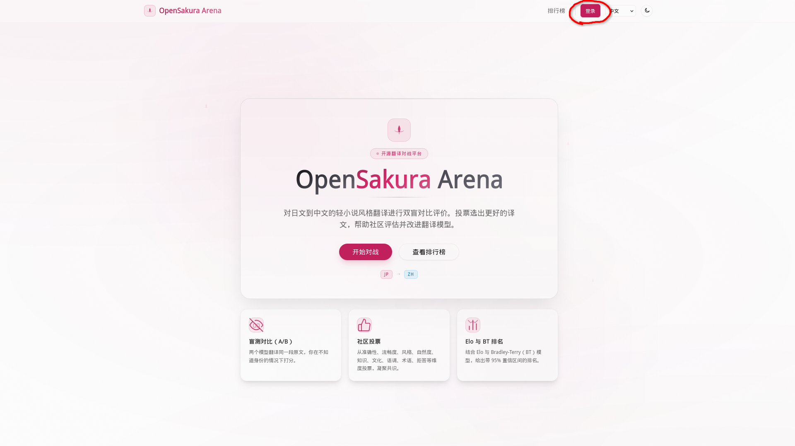
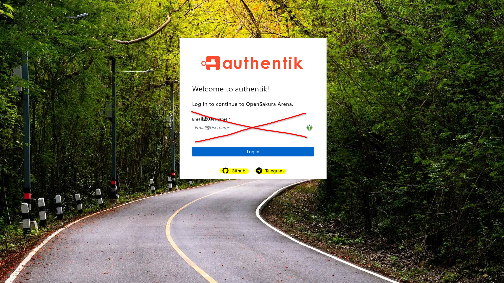
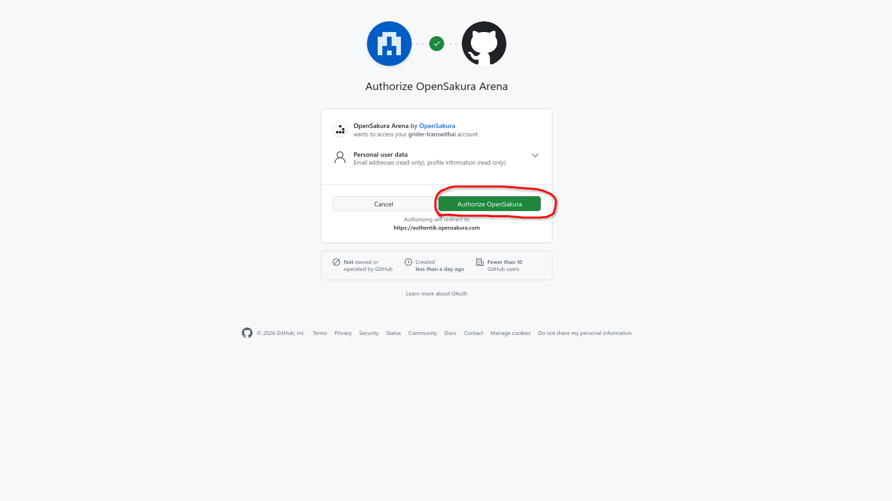
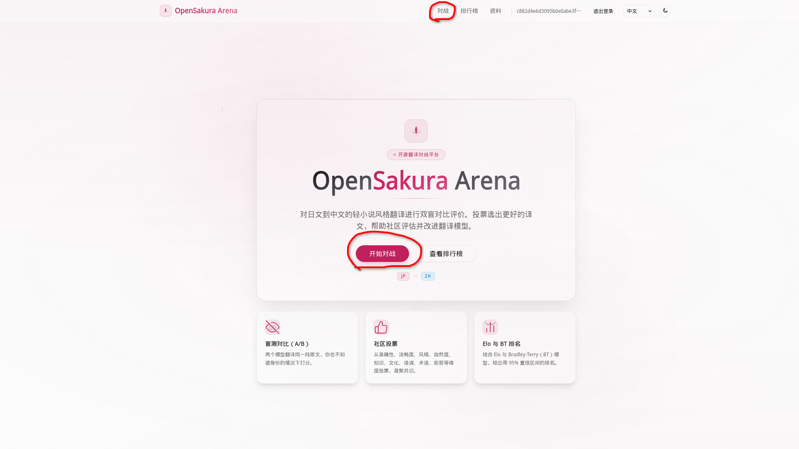
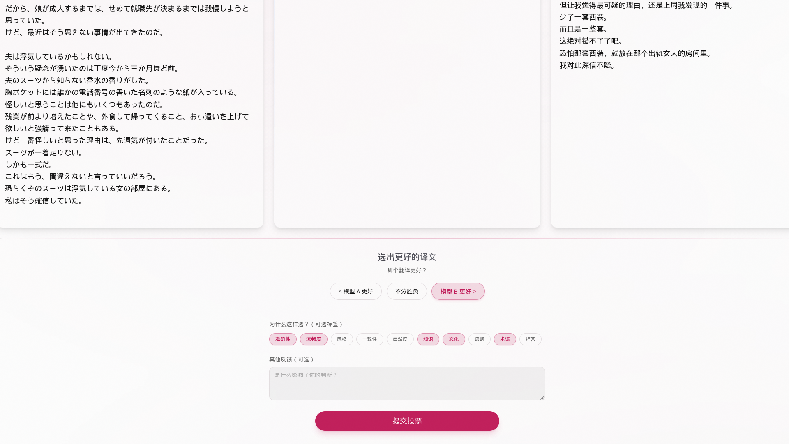

# OpenSakura 机翻竞技场食用教程

> 「翻译这种东西，光看一家之言可不行哦。来当裁判吧——亲手把模型们排出高下！」

OpenSakura Arena 是一个 **开源的日译中翻译模型盲测平台**，专为轻小说 / 视觉小说风格的 JP→ZH 翻译打造。两个模型翻译同一段原文，你在 **不知道它们身份** 的情况下投票，每一票都会实时刷新整个排行榜。

简单说，你的工作只有一个字：**当裁判（ジャッジ）**。下面手把手带你入坑～

---

## ✨ 它能做什么

| 功能 | 说明 |
| --- | --- |
| 🅰️🅱️ **盲测对比（A/B）** | 两个模型翻译同一段原文，身份保密，你只凭译文质量打分。 |
| 🗳️ **社区投票** | 从 **准确性、流畅度、风格、自然度、知识、文化、语调、术语、拒答** 等维度投票，凝聚共识。 |
| 📊 **Elo 与 BT 排名** | 结合 Elo 与 Bradley-Terry（BT）模型，给出带 **95% 置信区间** 的排名。 |

整套机制可以浓缩成一句中二台词：**「从原文到社区共建的模型排名，只需四步。」**

---

## 🌸 运作流程（只需四步）

```
①  原文        →  从精选任务库中抽取一段日文原文
②  盲测翻译    →  两个模型翻译同一段原文，身份保密
③  投出你的一票 →  阅读两份译文，选出更好的一份
④  更新排名    →  每次投票都会触发 Elo/BT 重新计算排名
```

> 想象一下：原文是「お题」，两位模型选手戴着面具登场，你是手握判定旗的裁判，喊出胜负的瞬间，排行榜的数字就跟着跳动——这就是竞技场的醍醐味。

---

## 🚪 第一步：登录入场

竞技场是个讲规矩的地方。**浏览排行榜无需登录**，但只要你想 **创建对战、查看对战、投票**，都得先报上名号。

1. 打开首页，点击右上角的 **「登录」** 按钮（就是那个被圈出来的家伙）。

   

2. 跳转到 **authentik** 统一登录页。这里支持第三方账号登录，挑个顺手的（比如 **GitHub** / **Telegram**）。

   

3. 首次登录会弹出 **OAuth 授权确认**。这一步只会读取你的邮箱与公开资料（read-only），放心点下绿色的 **「Authorize OpenSakura」**。

   

> 🔒 **安全小贴士**：授权码交换、PKCE、会话 Cookie 全部由后端处理，浏览器永远拿不到 OIDC 的 client secret 或任何 provider token。账号信息只读、绝不外泄，安心当你的裁判～

---

## ⚔️ 第二步：开一场对战

登录成功后回到首页，你会发现按钮全部「亮」了起来。点击 **「开始对战」** 即可入场（旁边的 **「查看排行榜」** 随时让你围观战况）。



关于配对规则，竞技场很贴心：

- **不选择模型** → 系统自动配对，纯随机遭遇战；
- **选择一个模型** → 它会和任意其他模型对局；
- **选择两个模型** → 固定对局，指名单挑。

⚠️ 注意：你选择的模型 **顺序只决定「谁和谁打」**，至于谁站 A 位、谁站 B 位，由 **服务端随机决定**——这正是「盲测」的关键，确保你不会因为位置先入为主。

随后系统会从 **精选任务库** 中抽一段日文原文，两位模型选手同台开译。你能实时看到它们的状态：`思考中…` → `正在输出` → `已完成`。

---

## 🗳️ 第三步：投出你的一票

两份译文出炉后，正戏开场。对照左右两栏译文，做出你的判定：



**① 选出更好的译文** —— 三选一：

- 🅰️ **模型 A 更好**
- 🤝 **不分胜负**
- 🅱️ **模型 B 更好**

**② 为什么这样选？（可选标签）** —— 勾选你看重的维度，让你的票更有分量：

| 维度 | 含义 |
| --- | --- |
| 准确性 | 忠实于原文，无漏译或误译 |
| 流畅度 | 目标语言表达流畅易读 |
| 风格 | 语气、语域及文学风格恰当 |
| 一致性 | 前后术语及角色语气保持一致 |
| 自然度 | 表达地道，宛如母语者所写 |
| 知识 | 正确理解特定领域的概念或背景 |
| 文化 | 妥善处理文化背景及细微差别 |
| 语调 | 保留角色的个性及说话特征 |
| 术语 | 准确翻译专有名词及特定术语 |
| 拒答 | 模型拒绝翻译或提供回答 |

**③ 其他反馈（可选）** —— 想吐槽两句「是什么影响了你的判断？」尽管写在文本框里。

确认无误，点下 **「提交投票」**。

---

## 🎭 第四步：揭晓与排名更新

投票一提交，面具即刻摘下——**「感谢投票！下面是每份译文背后的模型。」** 你会看到刚才两位选手的真实身份，以及谁戴上了 **胜者** 徽章（平局则标记「你判定为平局」）。

与此同时，后台的 **Elo / Bradley-Terry** 评分引擎立刻重算，把你的一票汇入 **排行榜**。意犹未尽的话：

- 点 **「再来一场」** 继续下一局；
- 点 **「重新对战」** 用同一段原文换批选手再战。

---

## 🏆 围观排行榜

在导航栏点 **「排行榜」**，即可查看模型们的综合战绩。这里支持多种筛选：

- **投票来源**：全部投票 / 人工投票 / 机器投票
- **评分方法**：Elo / Bradley-Terry
- **置信区间**：可显示 / 隐藏 95% CI

表格列出 **排名、模型、评分、95% CI、对战场数**，前排还有领奖台（Podium）展示。排名越靠前、置信区间越窄，说明这个模型「实力越稳」。

> 「暂无评分？那还等什么——开一场对战投票，这里就会出现模型排名啦！」

---

## 📝 顺手填个资料（可选）

在 **「资料」** 页，你可以填写昵称、界面语言、中文变体（简体 / 繁体）、日语水平（JLPT 自评）、日译中经验年数以及担任角色（翻译 / 校对 / 质检 / 组长）。这些信息仅用于后续的离线筛选与分析，不影响投票，纯属锦上添花。

---

## 🎌 结语

OpenSakura Arena 的核心很朴素：**靠社区的眼睛，把日译中翻译模型一票一票地排出真实高下。** 没有黑箱，没有内定，每一票都让排名更精准一点。

所以——还在等什么？戴上风纪委员（ジャッジメント）的臂章，喊出那句「夹击妹抖ですの！」，亲手给翻译模型们定罪吧。

> 「违规译文，由你来制裁——判定（夹击妹抖／ジャッジメント）开始ですの！🌸」
